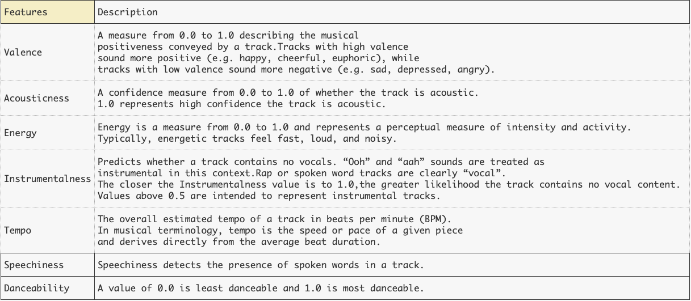
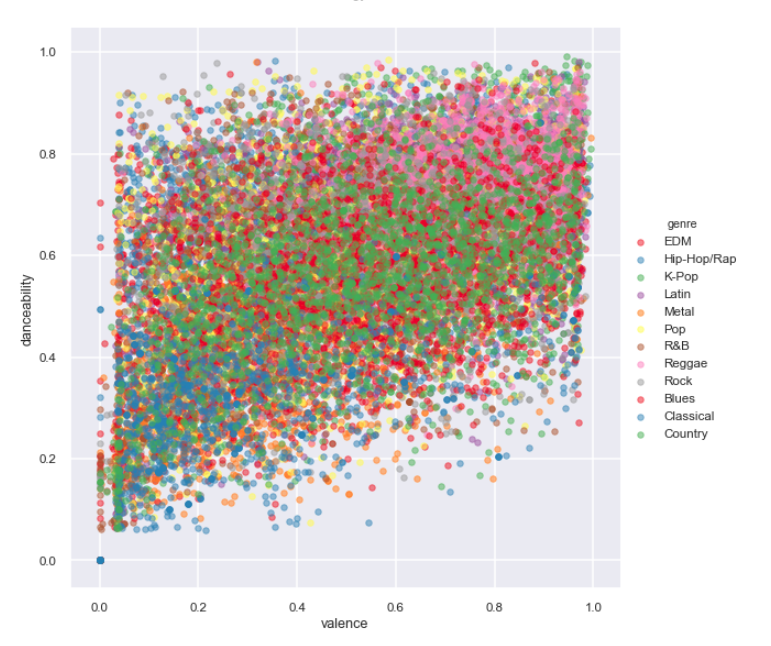
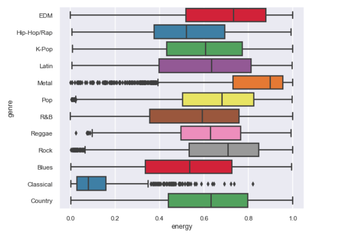

# Music-Rec
Presentation - (https://docs.google.com/presentation/d/1Pfg2n1KSGXKG3N-I3g5MKp2Su8YuQaN-lE8QANiySgQ/edit?usp=sharing)
 
Demo - (https://www.youtube.com/watch?v=cY7SsKV4brU)

## Overview 
Build a Recommendation system(Item-Item based). 

## Data Source 
Gather Data Using Spotify API. 

## Features

Features that are used to get the recommendation. 

## Exploratory Data Analysis(EDA)
- Comparing the two features.(Danceability vs. Valence)

- Energy of different genres. 

## Tools 
- Scikit Learn(Pair-wise distance)
    - Euclidean 
    - Cosine 
